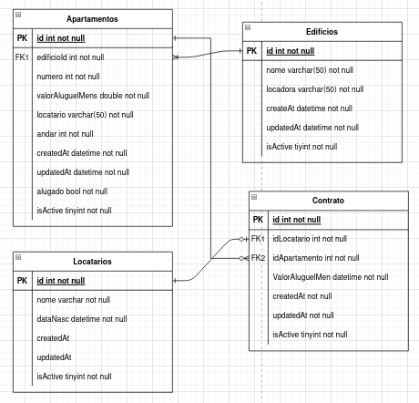

Para executar o backend da aplicação é necessario a instalação do dotnet core na versão 7.0 ou superior.

Para executar o frontend da aplicação é necessario a instalação do npm versão 9.5 ou superior e nodejs versão 18 ou superior.

Banco de dados Mysql versão 8.0

###### 

## Execução backend

###### Para a execução do backend favor alterar os arquivos BioparkContext.cs e Config/App.config com os dados de configuração do banco de dados.

###### Na raiz do projeto executar os comandos no terminal para carga inicial do banco de dados:

- `dotnet ef migrations add InitialCreate` (criação do snapshot do banco de dados)
- `dotnet ef database update` (criação das tabelas no banco de dados a partir do snapshot gerado)

###### Após a criação e configuração do banco de dados, executar o projeto WebApi na raiz, com o comando:

- `dotnet run` (execução do projeto em modo desenvolvimento)

Após a execuçao do comando dotnet run será informado host e porta no terminal onde a aplicação webapi REST estará rodando.

## Execução frontend

Frontend todo desenvolvido para web usando reactjs.

Configurar url da webapi no arquivo api.ts localizado na pasta client/api.ts

Após a execução da WebApi navegar até a pasta client/ na raiz do projeto e rodar os seguintes comandos para execução do  projeto frontend:

- `npm i` (instalação das dependencias)
- `npm start` (execução do projeto em modo dev)

Após a execução do comando npm start será informado no terminal o host e a porta que a aplicação vai estar em execução.

## Observação

Foi feito o deploy do backend na AWS, caso preferir, executar somente o frontend ao clonar o projeto, a configuração da url da webapi esta direcionada para a aws como padrão.

## Diagrama banco de dados

## 
